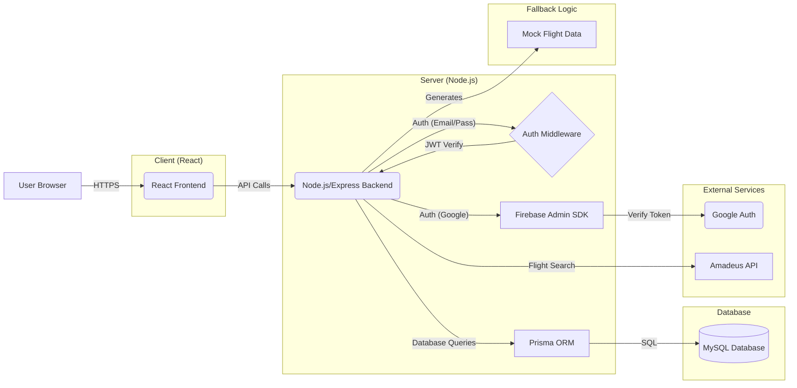
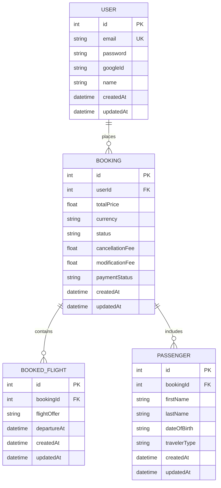

# Flight Booking Full-Stack Application

This is a full-stack web application for searching and booking flights, built with React, Node.js/Express, Prisma, and MySQL. It features user authentication, flight search via the Amadeus API (with mock data fallback), booking creation, viewing, cancellation, and editing capabilities.

## Features

- **User Authentication:**
  - Sign up with email/password.
  - Log in with email/password.
  - Log in/Sign up using Google (Firebase Authentication).
  - JWT-based session management.
  - Protected routes for authenticated users.
- **Flight Search:**
  - Search for one-way or round-trip flights using origin, destination, dates, and passenger count.
  - Integration with Amadeus API for real-time flight data.
  - Fallback to mock flight data if the API returns no results or fails.
  - Display detailed flight itineraries, including segments, duration, and pricing.
- **Booking Management:**
  - Create bookings from selected flight offers.
  - View a list of all bookings made by the logged-in user.
  - View detailed booking information, including flight segments and passenger details.
  - Cancel bookings (with mock fee calculation based on departure date).
  - Edit bookings by searching for and selecting a new flight (with mock fee and price difference calculation).
- **User Interface:**
  - Responsive design using Tailwind CSS.
  - Modern UI components (Cards, Buttons, Icons).
  - Smooth animations using Framer Motion.
  - Dark mode support.
  - Toast notifications for user feedback.

## Tech Stack

**Frontend:**

- React (Vite)
- React Router
- Tailwind CSS
- `@tanstack/react-query` (for data fetching and caching)
- `axios` (for API requests)
- `react-toastify` (for notifications)
- `react-datepicker`
- `framer-motion` (for animations)
- `firebase` (for Google Authentication)

**Backend:**

- Node.js
- Express.js
- Prisma (ORM)
- MySQL (Database)
- `jsonwebtoken` (JWT handling)
- `bcryptjs` (Password hashing)
- `firebase-admin` (Backend Google Auth verification)
- Amadeus Node SDK (`amadeus`)
- `cors`, `dotenv`, `cookie-parser`

## Architecture Diagram



## Database Schema Diagram



## Setup and Installation

1.  **Clone the repository:**

    ```bash
    git clone <your-repository-url>
    cd <repository-directory>
    ```

2.  **Install Backend Dependencies:**

    ```bash
    cd server
    npm install
    ```

3.  **Install Frontend Dependencies:**

    ```bash
    cd ../client
    npm install
    ```

4.  **Set up Environment Variables:**

    - **Backend (`server/.env`):** Create a `.env` file in the `server` directory and add the following variables:

      ```env
      DATABASE_URL="mysql://<user>:<password>@<host>:<port>/<database_name>"
      JWT_SECRET="<your_strong_jwt_secret>"
      JWT_EXPIRES_IN="30d" # Or your preferred expiration
      COOKIE_EXPIRES_IN="30" # In days

      # Amadeus API Credentials
      AMADEUS_CLIENT_ID="<your_amadeus_client_id>"
      AMADEUS_CLIENT_SECRET="<your_amadeus_client_secret>"

      # Firebase Admin SDK Configuration (Service Account Key)
      # Option 1: Path to the JSON key file
      # FIREBASE_SERVICE_ACCOUNT_PATH="./path/to/your/serviceAccountKey.json"
      # Option 2: Base64 encoded JSON key (useful for deployment)
      FIREBASE_SERVICE_ACCOUNT_BASE64="<base64_encoded_service_account_key_json>"

      # Client URL for CORS
      CLIENT_URL="http://localhost:5173" # Adjust if your client runs on a different port
      ```

      _Replace placeholders with your actual credentials._
      _You need a MySQL database running and accessible._
      _Obtain Amadeus API keys from their developer portal._
      _Generate a Firebase Admin SDK service account key from your Firebase project settings._

    - **Frontend (`client/.env.local`):** Create a `.env.local` file in the `client` directory and add:
      ```env
      VITE_API_BASE_URL=http://localhost:5000/api # Your backend API base URL
      VITE_FIREBASE_API_KEY="<your_firebase_web_api_key>"
      VITE_FIREBASE_AUTH_DOMAIN="<your_firebase_auth_domain>"
      VITE_FIREBASE_PROJECT_ID="<your_firebase_project_id>"
      VITE_FIREBASE_STORAGE_BUCKET="<your_firebase_storage_bucket>"
      VITE_FIREBASE_MESSAGING_SENDER_ID="<your_firebase_messaging_sender_id>"
      VITE_FIREBASE_APP_ID="<your_firebase_app_id>"
      ```
      _Replace placeholders with your Firebase Web App configuration details (found in Firebase project settings)._

5.  **Database Migration:**

    - Navigate to the `server` directory.
    - Apply Prisma migrations:
      ```bash
      npx prisma migrate dev --name <migration_name> # e.g., --name init
      ```
      _(Run `npx prisma generate` if needed after migrations)_

6.  **Run the Application:**

    - **Start the Backend Server:**

      ```bash
      cd server
      npm run dev # Or your start script (e.g., npm start)
      ```

      _The backend should typically run on port 5000 (or as configured)._

    - **Start the Frontend Development Server:**
      ```bash
      cd ../client
      npm run dev
      ```
      _The frontend should typically run on port 5173._

7.  **Access the Application:** Open your browser and navigate to `http://localhost:5173` (or the port your client is running on).

## API Endpoints (Brief Overview)

**Auth:**

- `POST /api/auth/signup`
- `POST /api/auth/login`
- `POST /api/auth/google`
- `GET /api/auth/logout`
- `GET /api/auth/me`

**Flights:**

- `GET /api/flights/search`

**Bookings:**

- `POST /api/bookings`
- `GET /api/bookings`
- `PATCH /api/bookings/:id/cancel`
- `PUT /api/bookings/:id`

---
