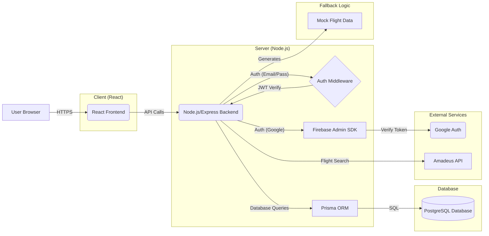
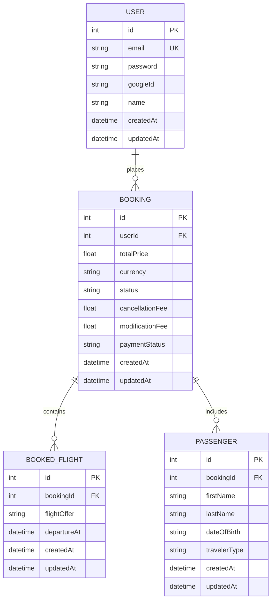

# Flight Booking Full-Stack Application

[](https://github.com/sunny348/flight/actions/workflows/ci.yml)


This is a full-stack web application for searching and booking flights, built with React, Node.js/Express, Prisma, and PostgreSQL. It features user authentication, flight search via the Amadeus API (with mock data fallback), booking creation, viewing, cancellation, and editing capabilities.

The backend is hardened for production-style review: a shared Prisma client, Helmet security headers, per-IP rate limiting on auth routes, Zod request validation, a centralized error handler, and an automated test suite that runs in CI (see [Testing](#testing)).

## Features

- **User Authentication:**
  - Sign up with email/password.
  - Log in with email/password.
  - Log in/Sign up using Google (Firebase Authentication).
  - JWT-based session management.
  - Protected routes for authenticated users.
- **Flight Search:**
  - Search for one-way or round-trip flights using origin, destination, dates, and passenger count.
  - Integration with Amadeus API for real-time flight data.
  - Fallback to mock flight data if the API returns no results or fails.
  - Display detailed flight itineraries, including segments, duration, and pricing.
- **Booking Management:**
  - Create bookings from selected flight offers.
  - View a list of all bookings made by the logged-in user.
  - View detailed booking information, including flight segments and passenger details.
  - Cancel bookings (with mock fee calculation based on departure date).
  - Edit bookings by searching for and selecting a new flight (with mock fee and price difference calculation).
- **User Interface:**
  - Responsive design using Tailwind CSS.
  - Modern UI components (Cards, Buttons, Icons).
  - Smooth animations using Framer Motion.
  - Dark mode support.
  - Toast notifications for user feedback.

## Tech Stack

**Frontend:**

- React (Vite)
- React Router
- Tailwind CSS
- `@tanstack/react-query` (for data fetching and caching)
- `axios` (for API requests)
- `react-toastify` (for notifications)
- `react-datepicker`
- `framer-motion` (for animations)
- `firebase` (for Google Authentication)

**Backend:**

- Node.js
- Express.js
- Prisma (ORM)
- PostgreSQL (Database)
- Redis (flight-search result cache via `ioredis`)
- `jsonwebtoken` (JWT handling)
- `bcryptjs` (Password hashing)
- `firebase-admin` (Backend Google Auth verification)
- Amadeus Node SDK (`amadeus`)
- `cors`, `dotenv`, `cookie-parser`

## Architecture Diagram


```mermaid
graph LR
    A[User Browser] -- HTTPS --> B(React Frontend);
    B -- API Calls --> C(Node.js/Express Backend);
    C -- Auth (Email/Pass) --> D{Auth Middleware};
    C -- Auth (Google) --> E[Firebase Admin SDK];
    E -- Verify Token --> F(Google Auth);
    D -- JWT Verify --> C;
    C -- Database Queries --> G[Prisma ORM];
    G -- SQL --> H[(PostgreSQL Database)];
    C -- Flight Search --> I[Amadeus API];
    C -- Generates --> J[Mock Flight Data];

    subgraph "Client (React)"
        B
    end

    subgraph "Server (Node.js)"
        C
        D
        E
        G
    end

    subgraph "Database"
        H
    end

    subgraph "External Services"
        F
        I
    end

    subgraph "Fallback Logic"
      J
    end

```

## Database Schema Diagram


```mermaid
erDiagram
    USER ||--o{ BOOKING : "places" 
    BOOKING ||--o{ BOOKED_FLIGHT : "contains"
    BOOKING ||--o{ PASSENGER : "includes"

    USER {
        int id PK
        string email UK
        string password
        string googleId
        string name
        datetime createdAt
        datetime updatedAt
    }

    BOOKING {
        int id PK
        int userId FK
        float totalPrice
        string currency
        string status
        float cancellationFee
        float modificationFee
        string paymentStatus
        datetime createdAt
        datetime updatedAt
    }

    BOOKED_FLIGHT {
        int id PK
        int bookingId FK
        string flightOffer
        datetime departureAt
        datetime createdAt
        datetime updatedAt
    }

    PASSENGER {
        int id PK
        int bookingId FK
        string firstName
        string lastName
        string dateOfBirth
        string travelerType
        datetime createdAt
        datetime updatedAt
    }
```

## Running with Docker (recommended)

The whole stack — **client + server + PostgreSQL + Redis** — runs with Docker Compose.

1.  **Create the server env file** (the server will not boot without it):

    ```bash
    cp server/.env.example server/.env
    ```

    Fill in real values — at minimum `JWT_SECRET` and `REFRESH_TOKEN_SECRET`
    (the server calls `process.exit(1)` if these are missing). `DATABASE_URL`,
    `REDIS_URL`, `CORS_ORIGIN`, and `REDIS_CACHE_TTL` are set automatically by
    `docker-compose.yml` for the containerized stack.

2.  **Build and start:**

    ```bash
    docker compose up --build
    ```

3.  **Access the app:**

    - Client: `http://localhost:3000`
    - API: `http://localhost:5000/api`
    - PostgreSQL: `localhost:5432` · Redis: `localhost:6379`

### Flight-search caching (Redis)

`GET /api/flights/search` uses a cache-aside strategy: identical searches are served
from Redis for `REDIS_CACHE_TTL` seconds (default 300) instead of re-calling the
Amadeus API. Redis is a non-fatal dependency — if it is down the endpoint still works,
just without caching. Mock fallback results are intentionally not cached.

```bash
# verify caching
docker compose exec redis redis-cli KEYS 'flights:*'
docker compose exec redis redis-cli TTL <key>
```

## Setup and Installation

> The steps below are for running the services manually (without Docker). For most
> cases prefer the **Running with Docker** section above. A running Redis instance is
> required for caching (or leave `REDIS_URL` unset and the app runs without a cache).

1.  **Clone the repository:**

    ```bash
    git clone <your-repository-url>
    cd <repository-directory>
    ```

2.  **Install Backend Dependencies:**

    ```bash
    cd server
    npm install
    ```

3.  **Install Frontend Dependencies:**

    ```bash
    cd ../client
    npm install
    ```

4.  **Set up Environment Variables:**

    - **Backend (`server/.env`):** Create a `.env` file in the `server` directory and add the following variables:

      ```env
      DATABASE_URL="postgresql://<user>:<password>@<host>:<port>/<database_name>"
      JWT_SECRET="<your_strong_jwt_secret>"
      JWT_EXPIRES_IN="30d" # Or your preferred expiration
      COOKIE_EXPIRES_IN="30" # In days

      # Amadeus API Credentials
      AMADEUS_CLIENT_ID="<your_amadeus_client_id>"
      AMADEUS_CLIENT_SECRET="<your_amadeus_client_secret>"

      # Firebase Admin SDK Configuration (Service Account Key)
      # Option 1: Path to the JSON key file
      # FIREBASE_SERVICE_ACCOUNT_PATH="./path/to/your/serviceAccountKey.json"
      # Option 2: Base64 encoded JSON key (useful for deployment)
      FIREBASE_SERVICE_ACCOUNT_BASE64="<base64_encoded_service_account_key_json>"

      # Client URL for CORS
      CLIENT_URL="http://localhost:5173" # Adjust if your client runs on a different port
      ```

      _Replace placeholders with your actual credentials._
      _You need a PostgreSQL database running and accessible._
      _Obtain Amadeus API keys from their developer portal._
      _Generate a Firebase Admin SDK service account key from your Firebase project settings._

    - **Frontend (`client/.env.local`):** Create a `.env.local` file in the `client` directory and add:
      ```env
      VITE_API_BASE_URL=http://localhost:5000/api # Your backend API base URL
      VITE_FIREBASE_API_KEY="<your_firebase_web_api_key>"
      VITE_FIREBASE_AUTH_DOMAIN="<your_firebase_auth_domain>"
      VITE_FIREBASE_PROJECT_ID="<your_firebase_project_id>"
      VITE_FIREBASE_STORAGE_BUCKET="<your_firebase_storage_bucket>"
      VITE_FIREBASE_MESSAGING_SENDER_ID="<your_firebase_messaging_sender_id>"
      VITE_FIREBASE_APP_ID="<your_firebase_app_id>"
      ```
      _Replace placeholders with your Firebase Web App configuration details (found in Firebase project settings)._

5.  **Database Migration:**

    - Navigate to the `server` directory.
    - Apply Prisma migrations:
      ```bash
      npx prisma migrate dev --name <migration_name> # e.g., --name init
      ```
      _(Run `npx prisma generate` if needed after migrations)_

6.  **Run the Application:**

    - **Start the Backend Server:**

      ```bash
      cd server
      npm run dev # Or your start script (e.g., npm start)
      ```

      _The backend should typically run on port 5000 (or as configured)._

    - **Start the Frontend Development Server:**
      ```bash
      cd ../client
      npm run dev
      ```
      _The frontend should typically run on port 5173._

7.  **Access the Application:** Open your browser and navigate to `http://localhost:5173` (or the port your client is running on).

## Testing

The server ships with a [Vitest](https://vitest.dev) + [Supertest](https://github.com/ladjs/supertest) suite. Prisma is deep-mocked, so the tests run **without a database, Redis, or any external service** — fast and deterministic, which is also why they run in CI on every push.

```bash
cd server
npm test            # run once
npm run test:watch  # watch mode
npm run test:coverage
```

What's covered:

- **Auth** (`tests/auth.test.js`) — signup success / duplicate (409) / validation (400); login invalid (401) / success (200).
- **Bookings** (`tests/bookings.test.js`) — auth guard (401), create validation (400), create (201), list, cancel, and ownership checks (403).
- **Flights** (`tests/flights.test.js`) — query validation (400), result passthrough, and param normalization.
- **Unit** — `jwtHelpers` (sign/verify round-trips) and the Zod validators.

### Continuous Integration

`.github/workflows/ci.yml` runs on every push and pull request across Node 20 and 22:

- **Server:** `npm ci` → `npm test`
- **Client:** `npm ci` → `npm run lint` → `npm run build`

### Reliability & Security hardening

- **Single Prisma client** (`server/src/lib/prisma.js`) shared across the app instead of a new pool per module.
- **Helmet** secure headers and **per-IP rate limiting** (`express-rate-limit`) on auth routes.
- **Zod** schema validation at the route boundary (`server/src/validators`, `middlewares/validate.js`).
- **Centralized error handling** (`middlewares/errorHandler.js`) with a consistent `{ status, message, errors? }` JSON envelope and a `/health` endpoint.

## API Endpoints (Brief Overview)

**System:**

- `GET /health` — liveness/readiness probe (`{ status: "ok", uptime }`)

**Auth:**

- `POST /api/auth/signup`
- `POST /api/auth/login`
- `POST /api/auth/google`
- `GET /api/auth/logout`
- `GET /api/auth/me`

**Flights:**

- `GET /api/flights/search`

**Bookings:**

- `POST /api/bookings`
- `GET /api/bookings`
- `PATCH /api/bookings/:id/cancel`
- `PUT /api/bookings/:id`

---
